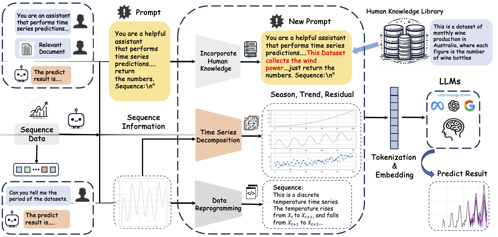

The official implementation of the paper "[Time series forecasting with llms: Understanding and enhancing model capabilities](https://dl.acm.org/doi/10.1145/3715073.3715083)", which is accepted by SIGKDD Explorations Newsletter.

# Time-Series-Forecasting-with-LLMs

Large language models (LLMs) have been applied in many fields and have developed rapidly in recent years. As a classic machine learning task, time series forecasting has recently been boosted by LLMs. Recent works treat large language models as \emph{zero-shot} time series reasoners without further fine-tuning, which achieves remarkable performance. However, some unexplored research problems exist when applying LLMs for time series forecasting under the zero-shot setting. For instance, the LLMs' preferences for the input time series are less understood. In this paper, by comparing LLMs with traditional time series forecasting models, we observe many interesting properties of LLMs in the context of time series forecasting. First, our study shows that LLMs perform well in predicting time series with clear patterns and trends but face challenges with datasets lacking periodicity. This observation can be explained by the ability of LLMs to recognize the underlying period within datasets, which is supported by our experiments. In addition, the input strategy is investigated, and it is found that incorporating external knowledge and adopting natural language paraphrases substantially improve the predictive performance of LLMs for time series. Our study contributes insight into LLMs' advantages and limitations in time series forecasting under different conditions.



### Brief Information for each file:
- 0_baseline_experiment.ipynb and 0_baseline_experiment_w_gemini.ipynb
These notebooks implement baseline predictions using pre-trained large language models (LLMs), including Gemini-based variants.
- 1_stl_decomposition.ipynb
This notebook applies Seasonal-Trend decomposition using LOESS (STL) to evaluate the strength of trend and seasonal components in time series data.
- 2_model_preference_analysis.ipynb
This notebook analyzes the preferences of LLMs when applied to various datasets by comparing their performance on both real-world and synthetic data.
- 3_Period_prediction_w_GEMINI.ipynb
This notebook performs period prediction using the Gemini model.
- 4_counterfactual_analysis.ipynb
This notebook conducts counterfactual analysis to assess model behavior under hypothetical scenarios.
- 5_impact_of_sequence_length.ipynb
This notebook investigates how varying input sequence lengths affect model predictions.
- 6_paraphrase_and_predict.ipynb
This notebook explores a method that combines input paraphrasing with prediction to evaluate the consistency and robustness of the model.

### Getting Started
- Installation
conda create -n time_llm python=3.10
conda activate time_llm
pip install -r requirements.txt
- Enter your `api_key` and `api_base` in the `config.json` file.

### Datasets

Please create the following directory structure:

```
datasets/
├── memorization/
├── monash/
└── synthetic/
```

Place the corresponding time series datasets referenced in the paper into these directories.


### Acknowledgement

We would like to acknowledge the following GitHub repository for providing a valuable code base:
[Large Language Models Are Zero-Shot Time Series Forecasters](https://github.com/ngruver/llmtime)

### Citation
If you find the code is vailuable, please use this citation.
```
@article{tang2025time,
  title={Time series forecasting with llms: Understanding and enhancing model capabilities},
  author={Tang, Hua and Zhang, Chong and Jin, Mingyu and Yu, Qinkai and Wang, Zhenting and Jin, Xiaobo and Zhang, Yongfeng and Du, Mengnan},
  journal={ACM SIGKDD Explorations Newsletter},
  volume={26},
  number={2},
  pages={109--118},
  year={2025},
  publisher={ACM New York, NY, USA}
}
```
